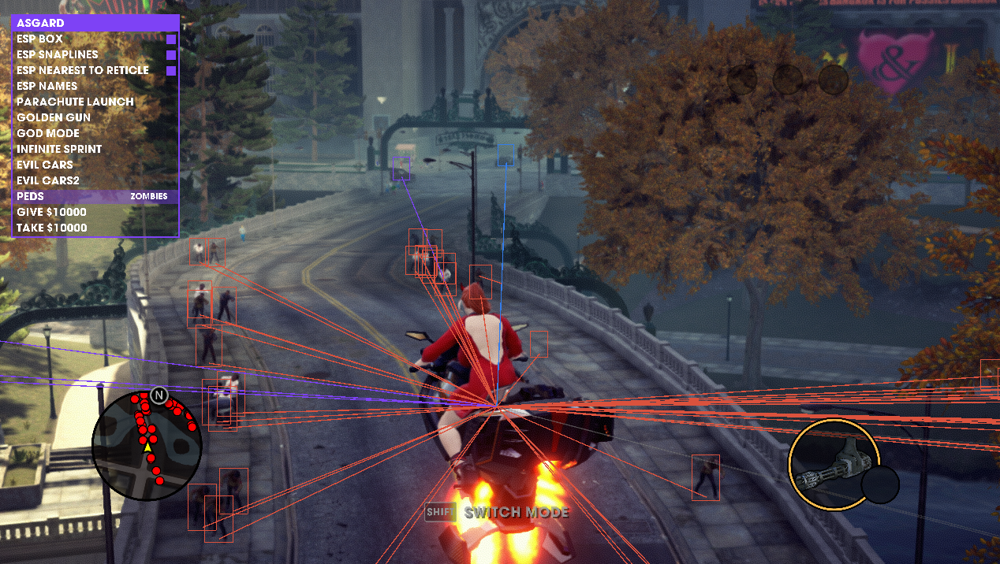

# SR3R (Saints Row The Third Remastered)

This is a reverse engineering project, I used Epic Store version of the game.

Engine: Proprietary Engine Core Technology Group and the Havok physics engine

### Usage
1. Gonna need [Microsoft Detours](https://github.com/microsoft/Detours)
2. I build the project with VS2022, Other versions of Visual Studio will work but will need to change 'Platform Toolset'
3. Compile with x64
4. Inject with any injector you want

### ESP Color
Purple: Your gang/friends
Grey: Civilians
Blue: Police
Red: Enemy Gang & Zombies
Green: Neutral Gang and not a regular civilian

# Dependencies
- [Microsoft Detours](https://github.com/microsoft/Detours)
